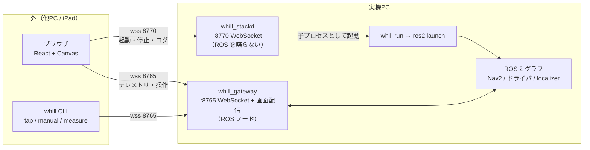
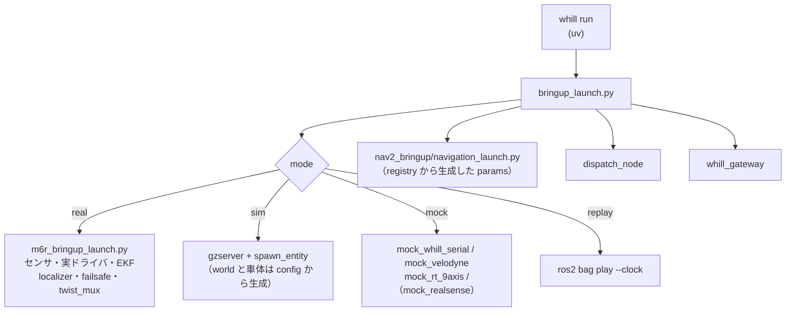
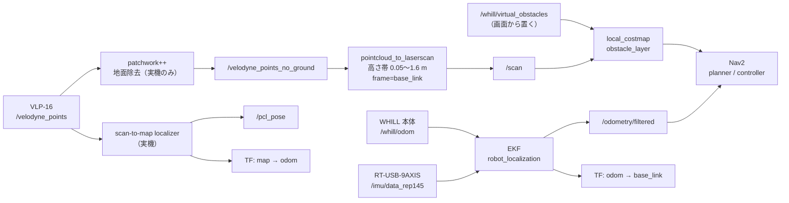
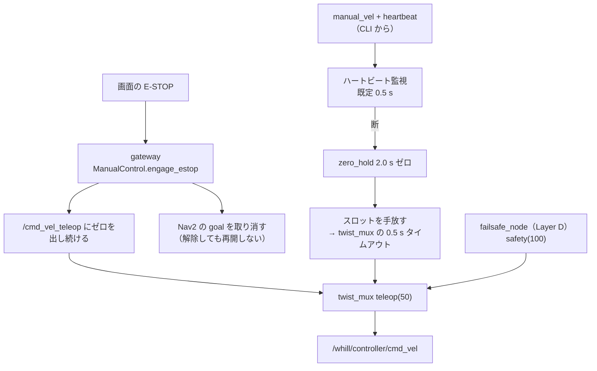
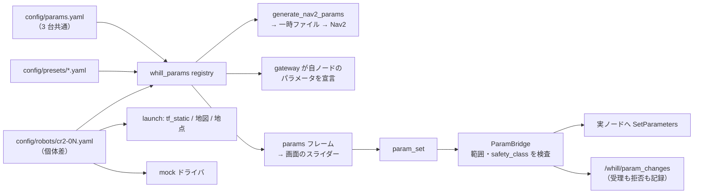
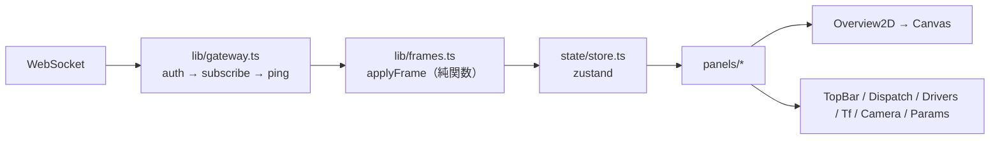

# アーキテクチャ（現行、2026-09-19）

**いま何がどう繋がっているか**を 1 か所にまとめる。
図を組版した読み物版: https://claude.ai/artifact/8kHnueoGLnjmh1gwbJ7A5X （中身はこの文書と同じ）。

設計の理由は `docs/requirements.md`
（設計原則）と `docs/adr/`、決まっていないことは `docs/open-questions.md`。

読む順:

1. 全体の口（§1）— 外から見た形
2. プロセス（§2）— モードごとに何が起動するか
3. データの流れ（§3）— どのトピックを誰が出して誰が受けるか
4. 安全の経路（§4）— 止める話だけを取り出したもの
5. 設定の流れ（§5）— 値がどこから来てどこへ行くか
6. Web（§6）— フレームが画面になるまで

---

## 1. 全体の口

**ROS は実機PC の中に閉じる。** 外から繋ぐ口は 2 つだけ（設計原則 1）。

- gateway は **ROS への唯一の口**。画面（`web/dist`）も同じ 8765 で配る
- stackd は**例外として認めた 2 本目**。ROS を喋らず、`whill run` を子プロセスとして
  管理するだけ（条件は CLAUDE.md の設計原則 1）
- rosbridge（9090）は使わない（ADR-0005）

---

## 2. プロセス（モードごと）

`whill run --mode <mode>` → `ros2 launch whill_bringup bringup_launch.py`。
**モードで変わるのはドライバ層と時刻源だけ**、という形に寄せてある。

| 起動するもの | real | sim | mock | replay |
|---|---|---|---|---|
| ドライバ | 既存スタック（実機） | Gazebo のプラグイン | mock ドライバ 4 種 | bag 再生 |
| static TF | 既存スタック | 本リポ（個体 yaml） | 本リポ（個体 yaml） | bag |
| map → odom | scan-to-map localizer | identity 固定 | identity 固定 | bag |
| odom → base_link | EKF（既存スタック） | 同じ EKF | 同じ EKF | bag |
| 地面除去（patchwork++） | ✓ | — （床が平ら） | — | — |
| `/scan` の作り方 | 点群 → p2ls | 点群 → p2ls | mock が直接出す | bag |
| Nav2 | ✓（本リポが起動） | ✓ | ✓ | **起動しない**（ADR-0004） |
| twist_mux | 既存スタック | 本リポ | 本リポ | — |
| 配車 dispatch_node | ✓ | ✓ | ✓ | — |
| gateway | `--gateway` で | 同左 | 同左 | 同左（実質必須） |
| `use_sim_time` | false | **true** | false | **true** |

**include するもの / しないもの**（`ros/src/whill_bringup/launch/bringup_launch.py`）:

- include する: `whill_safety/m6r_bringup_launch.py`（real）、`whill_perception/ground_removal_launch.py`（real）、
  `whill_localization/ekf_odom_launch.py`（mock / sim）、`nav2_bringup/navigation_launch.py`（real / sim / mock）
- **include しない**: `whill_navigation/nav_launch.py`（params を渡せず registry が効かない）、
  `whill_dispatch/dispatch_launch.py`（rosbridge と http.server を増やす）

---

## 3. データの流れ

### 3.1 センサ → Nav2

- IMU の姿勢は使わない（このドライバは推定していない。ADR-0006）
- 仮想障害物は costmap 層に注入する。永続化しない（Q5）

### 3.2 指令 → 車体（**実機と mock / sim で順序が違う**）

```mermaid
flowchart LR
  subgraph real["実機"]
    n1["controller_server → /cmd_vel_nav"] --> tm1["twist_mux<br/>safety 100 / teleop 50 / nav 10"]
    f1["failsafe_node → /cmd_vel_safety"] --> tm1
    g1["gateway → /cmd_vel_teleop"] --> tm1
    tm1 --> cv1["/cmd_vel"] --> vs1["velocity_smoother"] --> out1["/whill/controller/cmd_vel"]
  end
  subgraph mocksim["mock / sim"]
    n2["controller_server → /cmd_vel_nav"] --> vs2["velocity_smoother"] --> cv2["/cmd_vel"] --> tm2["twist_mux"]
    g2["gateway → /cmd_vel_teleop"] --> tm2
    tm2 --> out2["/whill/controller/cmd_vel"]
  end
```

**mock / sim では velocity_smoother が前段**なので、E-STOP のゼロが平滑を通らない
（＝ mock のほうが厳しく止まる）。実機の順序に合わせるのは実機確認のあと（K7）。

### 3.3 ROS → ブラウザ（gateway）

gateway が購読して、レート制限をかけて WebSocket に流す。

| 画面に出るもの | 元のトピック | 備考 |
|---|---|---|
| 俯瞰図の地図 | `/local_costmap/costmap`, `/global_costmap/costmap`（+ `_updates`） | 全量は latched で 1 回だけ来るので gateway が保持する（ADR-0002） |
| 車体の位置 | `/pcl_pose`（実機）/ `/odometry/filtered`（mock） | 来たほうを流す |
| 経路 | `/plan` | |
| レーザ | `/scan` | best-effort で購読（reliable だと 1 通も来ない） |
| TF の健全性 | `/tf`, `/tf_static` | 辺ごとの古さを判定して配る（#51） |
| ドライバの値 | `cr2-base.yaml` の `telemetry` 宣言どおり | 閾値判定は gateway 側 |
| カメラ | `/camera/camera/color/image_raw/compressed` | **パネルを開いている間だけ**購読 |
| 配車 | `/dispatch/state`, `/dispatch/waypoints` | |
| 再生位置 | `/clock` | replay のみ |

送る側（client → server）: `auth` / `subscribe` / `param_set` / `preset_apply` /
`manual_vel` / `heartbeat` / `estop` / `virtual_obstacles` / `ping` / `replay_control` /
`dispatch_submit` / `dispatch_cancel`

受け取る側（server → client）: `hello` / `status` / `error` / `params` / `param_changed` /
`costmap` / `costmap_update` / `pose` / `path` / `scan` / `tf` / `diagnostics` / `image` /
`pong` / `obstacles` / `replay` / `telemetry` / `dispatch_state` / `dispatch_waypoints`

**接続の流れ**: 接続 → `hello{authenticated:false}` → 5 秒以内に `auth{token}` →
既定の購読が入って `hello{authenticated:true}`。認証前に通るのは `hello` と `error` だけ。
トークン未設定では**起動しない**。

---

## 4. 安全の経路（止める話）

- **安全に関わる処理は ROS のタイマー・実時間クロックで回す。** asyncio 側に置くと、
  WebSocket が詰まったときに一緒に止まる（設計原則 4）
- gateway は teleop スロット（50）に書く。**Layer D（100）を迂回できない**
- gateway が死んだら launch ごと終了コード 1 で止まる（#49）。「画面から何も見えないのに
  スタックは生きている」を作らない
- gateway は SIGINT / SIGTERM で自分から止まる（#65）

---

## 5. 設定の流れ

優先度（左が弱い）: `params.yaml` < `robots/cr2-0N.yaml` < `presets/*.yaml` < スライダー。

- **生成した Nav2 params は既存スタックのテンプレートと差分ゼロ**であることを pytest が担保する
- `locked_while_moving` のパラメータは走行中に拒否する（走行中かは `/cmd_vel` で判定）
- 個体 yaml は launch（TF・地図・配車地点）、gateway（閾値・TF の期待値）、mock の三方から読まれる

---

## 6. Web（フレームが画面になるまで）

- **解釈は純関数に閉じる**（`applyFrame`）。テストは WebSocket 無しで書ける
- 知らない `type` は捨てるが、捨てた数を数える（古い画面に気づくため）
- 再接続したら状態を捨てる（古い costmap を残さない）
- レイアウトは dev / ops の 2 つ。既定値は用途が違うので別（追従・進行方向上・スライダーの有無）

---

## 7. どこに何があるか

| ディレクトリ | 中身 | 実行環境 |
|---|---|---|
| `config/` | params / robots / presets / DDS 設定 | — |
| `ros/src/whill_bringup` | 4 モードの launch、sim の world と車体の生成 | colcon |
| `ros/src/whill_gateway` | WebSocket サーバ、テレメトリ、TF、配車の橋渡し、画面配信 | colcon |
| `ros/src/whill_params` | registry、Nav2 params 生成、descriptor 宣言 | colcon |
| `ros/src/whill_mock_drivers` | 実ドライバと同じ宣言で振る舞う mock | colcon |
| `ros/src/whill_costmap_plugins` | 仮想障害物の costmap 層（C++） | colcon |
| `services/whill_cli` | `whill`（run / doctor / tap / manual / params / measure …） | uv |
| `services/whill_stackd` | 常駐サービス（起動・停止・ログ） | uv |
| `web/` | React + Vite。成果物は gateway が配る | pnpm |
| `docs/` | 要件・ADR・runbook・計測・Phase 7 の計画と点検票 | — |

**既存スタック `~/whill_lab0_ros2` は参照と include の対象**で、編集しない。
Nav2 の設定は本リポが生成し、**差分ゼロ**であることをテストで担保している。
